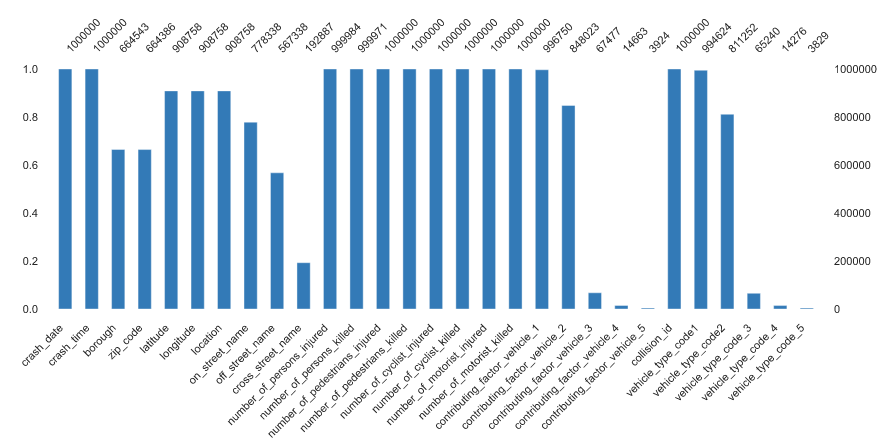

# Data preprocessing - NYC Motor Vehicle Crashes

Challenge realized during my Data Processing Training @BeCode

- Type of Challenge: `Consolidation` 
- Duration `2 days`
- Team challenge : `solo`

## Summary

### Mission objectives

- Be able to use pandas
- Be able to clean a data set
- Be able to do prepare a data set for a machine learning model

### The Mission

Bill de Blasio, mayor of New York City, is in a bit of a pickle. Indeed, his police department, the NYPD, collected information about all the traffic accidents that happened in New York City. However, they are too busy eating doughnuts to correctly encode each traffic indicent, and so it happens that the dataset that we got here is quite dirty, has a lot of missing values and can't be used by a machine learning model as is.
Can you help Mr. de Blasio and shine a new light on his police department ?
I am sure that you are well equipped to handle this.

#### Must-have features

- [x] The dataset contains no missing values ("" or null)
- [x] No duplicates
- [x] Values are consolidated
- [x] Data format is correct
- [x] No blank spaces (ex: " I love python " => "I love python")

#### Nice-to-have features

- [x] The more rows of data you use, the better. However, pay attention that the more data you have, the longer each operation needs to execute.
- [x] Add new features computed using the features present that you think are going to be useful.
- [x] Apply the preprocessing steps needed so that a future machine learning model can make the best use out of it **(feature selection, feature engineering, feature normalization, and resampling)**. You have to decide which one are necessary and which ones aren't.

## The dataset
An example dataset of 10.000 records  is avalailabe in the `data`folder ([link to `data_10000.csv`](data/data_10000.csv))

> Initial shape (1.000.000, 29)
>
> Final shape (907.919, 82)

You can find more information on the structure and download the full dataset on the [`NYC OpenData website`](https://data.cityofnewyork.us/Public-Safety/Motor-Vehicle-Collisions-Crashes/h9gi-nx95)

## The process

### Step 1 : Initial data profiling

Before starting to process this file, I performed data profiling with the `Pandas-Profiling` python module.

This first step made allows to obtain a global vision of the task to be undertaken.

You can find the data profiling result files in the `profiling` folder

#### Missing cells

In this case, there is a lot of missing cells (29.6%) :

| Field       | Missing values |
| ----------- | -------------- |
| `borough`, `zipcode` | 35 % |
| `location`, `latitude`, `longitude` | 8 % |
| `on_street_name` | 26 % |
| `off_street_name` | 53 % |
| `cross_street_name` | 78 % |
| `contributing_factor_vehicle_1` ... `contributing_factor_vehicle_5` | 0,4% - 99% |
| `vehicule_type_code_1` ... `vehicule_type_code_5` | 0,7% - 99% |
|  |  |

### Step 2 : Data cleaning

This step is important to generate a consistent output data files. I need to :

- Suppress the duplicate rows (no duplicate found)
- Suppress the missing value
- Set the rigth data format
- Standardize the strings values

#### String standardization

All string value where reformatted to :

* remove leading and trailing withespaces
* remove multiple blank space
* capitalize each word

#### Zip_code / Borough

These two fields have a lot of missing information and seemed interresiting to resolve. So I tried :

- compute the nearest point with `scipy.spatial.distance.cdist` on the basis of location information
- compute the value on the basis of the data of lines where the location is similar
- compute the value on the basis of the data of lines where the street fields are similar

The first technique was OK with small dataset but crashed my computer when I tried it on a 100.000 records dataset. So it not possible to use it with a whole dataset of about 1.700.000 records and only allow to reduce the missing value to 26%.

The second was more scalable on large dataset but give a less good result than the first method.
On a 1.000.000 record this operation take multiple hours to reduct missing values to 29%.

And the last one give a really poor result by reducing the missing values by less than 1%.

After these test, it seems difficult to obtain better result.

Finally these missing information was substituted by default values to be able to identify them in the future.

#### Location / Longitude / Latitude

To deal with these missing data, I tried several techniques :

- complete it on the basis of the data of lines where the streets are similar and this information is not missing
- call an geo reverse API to retrieve the rigth information

The first method allows me to reduce this missing information from 8% to 7,7%.
The process is slow and on a 1.000.000 dataset the impact is long for a so small result.

The second method gives better result but it also not achievable in the challenge's allocated time and so was abandoned.

Finally, due the small impact on the final data size, I decided to delete these rows from the dataset.

#### On_street_name / Off_street_name / Cross_street_name

To deal with this street information, I started by removing encoding error (only numeric value, multiple street name with & between information).

By analysing the content of these fields, there is no street information when the location is missing. This missing values was deleted in the precedent point.
For the other records, we can distinct two cases :

* `on_street_name` is filled with or without `off_street_name` but
* `cross_street_name` is set only when `on_street_name` is `null`

The `cross_street_info` contains also street number in his field. So I decided to suppress this number information to obtain a street_name standardized with the `on_street_name` syntax. This information was use to complete the `on_street_name` column.

The `off_street_name` is completed when the `location` correspond to a crossroads. So the missing value were completed by `Unknown`.

#### Number_of_person_injured / Number_of_person_killed

These fields have a really small missing information. Due it corresponds to the sum of pedestrians/cyclist/motorist injured or killed, this information was computed and I checked that existing values were correct.

#### Contributing_factor_vehicle_1 ... contributing_factor_vehicle_5

These fields contains only few different values (60 in the 1.000.000 dataset), this information seems correct and preformated by the input informatic system. 

Then only missing values where completed by a default value.

#### Vehicule_type_code_1 ... vehicule_type_code_5

These fiels contains a lot of differents values (1.000+ in the 1.000.000 dataset) and seems be the result of a free manual encoding.
By lack of time it was impossible to harmonize it manually and this solution will leave problem if a new entry is encoded in the future.
Then I decided to reduce the different values on basis of the frequency of each one. So when a entry is present less than 1% of the dataset size, this one is remplaced by `Other`. The missing values where replaced by `Unspecified`
This small modification allow us to reduce this list to 15 entries.

### Step 3 : Deleting Row/Column unuseful

After all the previous steps, we have also identified unuseful columns that will be deleted from the dataset.
So I dropped `collision_id`, `cross_street_name`, `location`.

The future will show us if it's needed to remove other information not needed to the machine learning process. By lack of information on the final objctive it's not possible to determine if the `zip_code`and `borough`migth be kept at this time. 

### Step 4 : Pre-processing

After the data cleaning and completion it's time to take in charge the pre-processing of the output generated.

#### Features slicing

The `crash_date` and `crash_time` were sliced in multiple columns to allows a better analysis in the future.
These new fields are : `year`, `month`, `day`, `day_of_week`, `week`, `hour`, `minute`.

#### Dummies

The values from `borough`, `vehicle_type_code_#` and `contributing_factor_vehicle_#` were transformed into dummies.

#### Features engeneering

On the basis of the different killed/injured sums, I created some new features that can be use as target for a machine learning model.

| Feature               | Based on                        |
| --------------------- | ------------------------------- |
| `persons_injured`     | `number_of_persons_injured`     |
| `persons_killed`      | `number_of_persons_killed`      |
| `pedestrians_injured` | `number_of_pedestrians_injured` |
| `pedestrians_killed`  | `number_of_pedestrians_killed`  |
| `cyclist_injured`     | `number_of_cyclist_injured`     |
| `cyclist_killed`      | `number_of_cyclist_killed`      |
| `motorist_injured`    | `number_of_motorist_injured`    |
| `motorist_killed`     | `number_of_motorist_killed`     |

#### Splitting

At this time we have a large amount of data which could be use to create a predictive system based on it.
For this step I decided to focus te next steps to only one target `persons_killed`.

To achieve this, I keep only few columns needed columns of the initial source to create training and test data.

#### Feature standardization

After the spliting of the file to separate the training and the test data, it's time to normalize the different field contained in it.

Due the machine learning argorithm that will be used to implement it's not needed to transform textual information to a numeric values. 
So only the numeric values will be standardized by using a `z-score scaling`.

## Usage

This project is made in different Jupyter Notebooks. 

You can run them separately :

- Data Cleaning : see [01_data_cleaning.ipynb](01_data_cleaning.ipynb)
- Data Preprocessing : see [02_data_preprocessing.ipynb](02_data_preprocessing.ipynb)

## Installation

To run these different Jupyter Notebooks, you need these python modules :

- numpy
- pandas
- pandas_profiling
- sklearn

 

 

